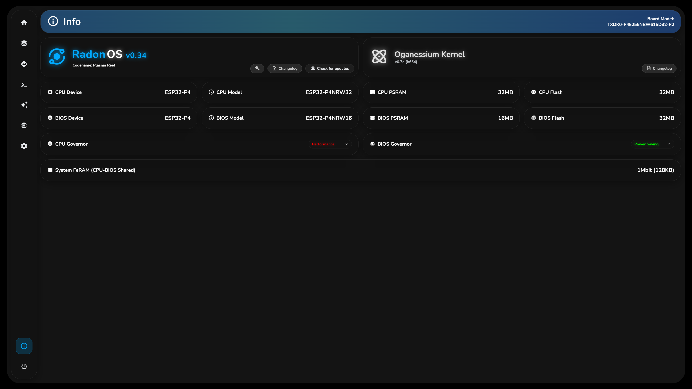

# RadonOS

  

RadonOS is a lightweight, modular operating system built for modern ESP32-based boards.

It is the core OS behind the **TerrariumX ecosystem**, but it can also be used as a standalone platform for advanced ESP32 projects that need reliability, structure, and a clean local interface.

RadonOS is designed with a simple idea in mind: **treat embedded systems like real systems**, not disposable firmware.

---

## ✨ What RadonOS is about

RadonOS focuses on:

* 🧩 **Modularity** – services are independent and restartable
* 🌐 **Local-first operation** – no cloud required
* 🔌 **MQTT-native design** – easy Home Assistant and automation integration
* 🖥️ **Modern WebUI** – animated, responsive, and optimized for embedded hardware
* 🛠️ **Long-term support** – hardware and software designed to evolve together
* 🔁 **Multi-MCU awareness** – ready for boards with main MCU + secondary / BIOS MCU

---

## 🧩 Supported Boards and Hardware

### Waveshare boards

| Board                   | MCU      | Notes                          | Support       | Auto pin config | Manual Pin config |
| ----------------------- | -------- | ------------------------------ |---------------| --------------- | ----------------- |
| ESP32-P4-Module-DEV-KIT | ESP32-P4 | Full-featured dev-kit          |✅ At launch   | ✅ Yes         | ✅ Compatible     | 
| ESP32-P4-WIFI6-DEV-KIT  | ESP32-P4 | Full-featured dev-kit          |✅ At launch   | ✅ Yes         | ✅ Compatible     | 
| ESP32-P4-NANO           | ESP32-P4 | Compact form factor            |✅ At launch   | ✅ Yes         | ✅ Compatible     | 
| ESP32-P4-WIFI6          | ESP32-P4 | WiFi-enabled variant           |✅ At launch   | ✅ Yes         | ✅ Compatible     | 
| ESP32-P4-ETH            | ESP32-P4 | Ethernet-enabled variant       |✅ At launch   | ✅ Yes         | ✅ Compatible     | 
| ESP32-S3-ETH            | ESP32-S3 | Ethernet-enabled variant       |✅ At launch   | ✅ Yes         | ✅ Compatible     | 
| ESP32-S3-Mini           | ESP32-S3 | Small form factor WiFi-enabled |✅ At launch   | ❌ No          | ✅ Compatible     | 
| ESP32-S3-Nano           | ESP32-S3 | WiFi-enabled dev-kit           |✅ At launch   | ❌ No          | ✅ Compatible     | 

### TerrariumX boards

| Board     | MCU                        | Notes                          |
| --------- | -------------------------- | ------------------------------ |
| **TXDK0** | ESP32-P4 (dual-MCU design) | Reference board for TerrariumX |

### General DevKits (will not use the Auto-Configuration of pins)

| Family             | Supported | Notes                                                                                |
| ------------------ | --------- | ----------------------------------------------------------------------------------- |
| ESP32-P4           | ✅         | Primary target platform                                                            |
| ESP32-S3           | ✅         | Supported at launch                                                                |
| ESP32-S2           | ✅         | Supported at launch                                                                |
| ESP32-C6           | 🛠️         | Supported after launch (v. >= 1.2)                                                 |
| ESP32-C61          | 🛠️         | Supported after launch (v. >= 1.2)                                                 |
| ESP32-C5           | 🛠️         | Supported after launch (v. >= 1.2)                                                 |
| ESP32-C3           | 🛠️         | Supported after launch (v. >= 1.2)                                                 |
| ESP8685 (C3 Based) | 🛠️         | Supported after launch (v. >= 1.2)                                                 |
| ESP32-C2 (ESP8684) | 🛠️         | Supported after launch (v. >= 1.2)                                                 |
| ESP32-H2           | 🛠️         | Only for certain software variations and will be supported later than other modules|
| ESP32              | 🛠️         | Supported in 1.1                                                                   |
| ESP8266            | ❌         | Missing fundamental software component (FreeRTOS)                                  |
| ESP8285            | ❌         | Missing fundamental software component (FreeRTOS)                                  |
| ESP8089            | ❌         | EOL and Missing fundamental software component (FreeRTOS)                          |

> Specific board support may vary in capabilities depending on the board hardware configuration.

> The ESP8266 and ESP8285 are not supported at launch because they are marked NRND by Espressif and lack full FreeRTOS support, which is a core requirement for RadonOS.

### General Requirements
|           | MCU Family          | Flash  | PSRAM  | Connectivity         | GPIO                                          |
| --------- | ------------------- | ------ | ------ | -------------------- | --------------------------------------------- |
| Suggested | ESP32-S2+           | >= 8MB | >= 1MB | WiFi and/or Ethernet | >= 9 Data GPIOs and 6 Power (3V3 / GND / VIN) |
| Minimal   | Any ESP32-class SoC | >= 4MB | >= 0MB | WiFi                 | >= 3 Data GPIOs and 2 Power (3V3 / GND)       |

---

## 🧠 Architecture (high level)

RadonOS uses a **service-oriented architecture**:

* Core kernel
* Hardware Abstraction Layer (HAL)
* Independent system services (GPIO, Network, Storage, Sensors, Power, etc.)
* Local WebUI server
* MQTT bridge

Each service can be started, stopped, or restarted independently, improving reliability and making debugging much easier compared to monolithic firmware designs.

---

## 🌐 WebUI

RadonOS includes a fully local WebUI that runs directly on the device:

* Modern Material-inspired design
* Smooth animations and micro-interactions
* System monitoring and diagnostics
* Power and service control
* OTA and update management (experimental)

Despite the visual complexity, the WebUI is designed to stay lightweight and efficient, making it suitable even for constrained embedded hardware.

---

### 🔄 Updates, OTA & long-term support

RadonOS uses a user-controlled update model.

Updates are never forced: the system checks for updates only when explicitly requested, and applying them is always a conscious user action.

When a board or firmware branch reaches **End Of Life (EOL)**, it enters a **Frozen** state:
- The device remains fully functional
- No new features or updates are provided
- The last supported firmware version remains available
- No forced updates, migrations, or shutdowns occur
- The EOL / Frozen status is clearly reported in the local WebUI

This approach prioritizes long-term stability and ensures that deployed systems can continue to operate reliably without unexpected changes.

Based on Espressif’s **Longevity Commitment**, currently supported hardware will enter the **Frozen** state (no further updates) according to the following timeline:

| SoC        | EOL Year | Currently supported |
| ---------- | -------- | ------------------- |
| ESP32-P4  | TBA      | ✅ Yes (initial)    |
| ESP32-S3  | 2033     | ✅ Yes              |
| ESP32-S2  | 2032     | ✅ Yes              |
| ESP32-C6  | 2035     | ✅ Yes              |
| ESP32-C61 | TBA      | ✅ Yes (initial)    |
| ESP32-C5  | 2037     | ✅ Yes              |
| ESP32-C3  | 2033     | ✅ Yes              |
| ESP8685   | 2033     | ✅ Yes              |
| ESP32-C2  | 2034     | ✅ Yes              |
| ESP8684   | 2034     | ✅ Yes              |
| ESP32-H2  | 2035     | ✅ Yes              |
| ESP32     | 2031     | ✅ Yes              |

> Models marked as **TBA** do not yet have an official EOL date, as they are not currently listed in Espressif’s longevity commitment.

> Support for each device ends on **January 1st** of the year specified in the table.

---

## 🚧 Project Status

RadonOS is under **active development**.

This means:

* Rapid iteration
* New features arriving frequently
* Possible breaking changes in early versions

If you are using RadonOS for testing or development, feedback is highly appreciated.

---

## 🤝 Contributing

Contributions are welcome.

You can help by:

* Testing on supported boards
* Reporting issues
* Improving documentation
* Adding support for new hardware

Feel free to open issues or pull requests.

---

## 🔓 License

RadonOS is fully **open source** and free to use.

See the LICENSE file for detailed license information.
