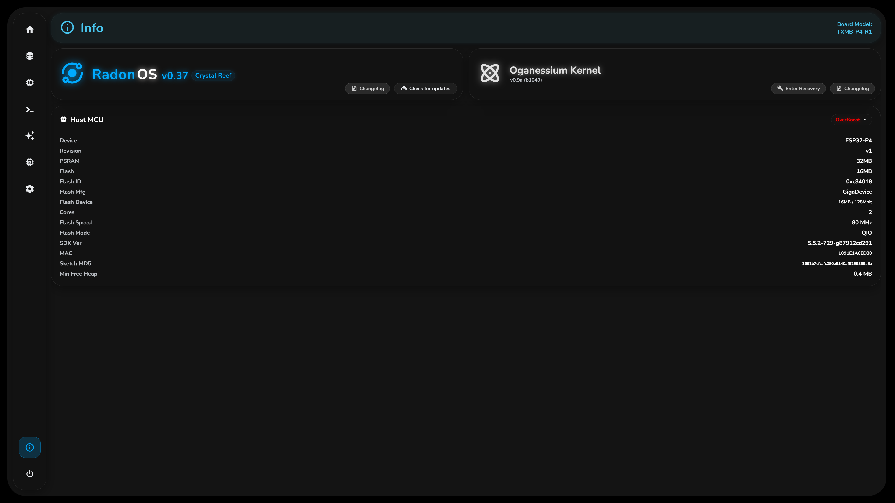

# RadonOS

  

RadonOS is a lightweight, modular operating system built for modern ESP32-based boards.

It is the core OS behind the **TerrariumX ecosystem**, but it can also be used as a standalone platform for advanced ESP32 projects that need reliability, structure, and a clean local interface.

RadonOS is designed with a simple idea in mind: **treat embedded systems like real systems**, not disposable firmware.

---
## 📅 Release date
RadonOS 1.00 will be available as fully stable and tested between **Q1 2026 and Q2 2026**

For now expect releases for pre-stable versions (like 0.xx), they are there to show progress and can be used to see the real status of things on a ESP32-P4-Module-DEV-KIT from Waveshare

---

## ✨ What RadonOS is about

RadonOS focuses on:

* 🧩 **Modularity** – services are independent and restartable
* 🌐 **Local-first operation** – no cloud required
* 🔌 **MQTT-native design** – easy Home Assistant and automation integration
* 🖥️ **Modern WebUI** – animated, responsive, and optimized for embedded hardware
* 🛠️ **Long-term support** – hardware and software designed to evolve together
* 🔁 **Multi-MCU awareness** – ready for boards with main MCU + secondary / BIOS MCU

---

## 🧩 Supported Boards and Hardware

### Waveshare boards

| Board                   | MCU      | Notes                          | Support | Tested |
| ----------------------- | -------- | ------------------------------ | ------- | ------ |
| ESP32-P4-Module-DEV-KIT | ESP32-P4 | Full-featured dev-kit          |✅       | ✅    |
| ESP32-P4-WIFI6-DEV-KIT  | ESP32-P4 | Full-featured dev-kit          |✅       | ❌    |
| ESP32-P4-NANO           | ESP32-P4 | Compact form factor            |✅       | ❌    |
| ESP32-P4-WIFI6          | ESP32-P4 | WiFi-enabled variant           |✅       | ❌    |
| ESP32-P4-ETH            | ESP32-P4 | Ethernet-enabled variant       |✅       | ❌    |
| ESP32-S3-ETH            | ESP32-S3 | Ethernet-enabled variant       |✅       | ❌    |
| ESP32-S3-Mini           | ESP32-S3 | Small form factor WiFi-enabled |✅       | ❌    |
| ESP32-S3-Nano           | ESP32-S3 | WiFi-enabled dev-kit           |✅       | ❌    |

### TerrariumX boards

| Board          | MCU         | Notes                               | Support      | Tested |
| -------------- | ----------- | ----------------------------------- | ------------ | ------ |
| **TXMB-P4-R1** | ESP32-P4 x2 | In house-engineered TerrarumX Board | ✅ (v1.0)   | ❌     |

### General DevKits

| Family             | Supported  | Tested in Preview Builds? | Notes                                                                                  |
| ------------------ | ---------- | ------------------------- | -------------------------------------------------------------------------------------- | 
| ESP32-P4           | ✅         | ✅                       | Primary target platform                                                                | 
| ESP32-S3           | ✅         | ✅                       | Supported at launch                                                                    |
| ESP32-S2           | ✅         | ❌                       | Supported at launch                                                                    |
| ESP32-C6           | 🛠️         | ✅                       | Supported after update                                                                 |
| ESP32-C61          | 🛠️         | ❌                       | Supported after update                                                                 |
| ESP32-C5           | 🛠️         | ✅                       | Supported after update                                                                 |
| ESP32-C3           | 🛠️         | ❌                       | Supported after update                                                                 |
| ESP8685 (C3 Based) | 🛠️         | ❌                       | Supported after update                                                                 |
| ESP32-C2 (ESP8684) | 🛠️         | ❌                       | Supported after update                                                                 |
| ESP32-H2           | 🛠️         | ❌                       | Only for certain software variations and will be supported later than other modules    |
| ESP32              | 🛠️         | ❌                       | Supported soon after launch                                                            |
| ESP32-E22          | ❓TBA      | ❌                       | Unreleased Module                                                                      |
| ESP32-H21          | ❓TBA      | ❌                       | Unreleased Module                                                                      |
| ESP32-H4           | ❓TBA      | ❌                       | Unreleased Module                                                                      |
| ESP8266            | ❌         | ❌                       | Missing fundamental software component (FreeRTOS)                                      |
| ESP8285            | ❌         | ❌                       | Missing fundamental software component (FreeRTOS)                                      |
| ESP8089 (ESP-01)   | ❌         | ❌                       | EOL and Missing fundamental software component (FreeRTOS), also, it is not programmable|

> Specific board support may vary in capabilities depending on the board hardware configuration.

> The ESP8266 and ESP8285 are not supported at launch because they are marked NRND by Espressif and lack full FreeRTOS support, which is a core requirement for RadonOS.

> While RadonOS 1.0 is not based on FreeRTOS, updates as early as 1.1 can be based on it, and as such, hardware with no full FreeRTOS support will lose future support after only one update, so such hardware is excluded directly.

> Any Hardware that Espressif releases at CES-2026 will be places in the table above as soon as possible

### General Requirements
|           | MCU Family          | Flash  | PSRAM  | Connectivity               | GPIO                                          |
| --------- | ------------------- | ------ | ------ | -------------------------- | --------------------------------------------- |
| Suggested | ESP32-S2+           | >= 8MB | >= 1MB | WiFi and/or Ethernet + BLE | >= 9 Data GPIOs and 6 Power (3V3 / GND / VIN) |
| Minimal   | Any ESP32-class SoC | >= 4MB | >= 0MB | Any kind                   | >= 3 Data GPIOs and 2 Power (3V3 / GND)       |

---

## 🧠 Architecture (high level)

RadonOS uses a **service-oriented architecture**:

* Core kernel (Internally called Oganessium Kernel)
* Hardware Abstraction Layer (HAL)
* Independent system services (GPIO, Network, Storage, Sensors, Power, etc.)
* Local WebUI server
* MQTT bridge

Each service can be started, stopped, or restarted independently, improving reliability and making debugging much easier compared to monolithic firmware designs.

---

## 🌐 WebUI

RadonOS includes a fully local WebUI that runs directly on the device:

* Modern Material-inspired design
* Smooth animations and micro-interactions
* System monitoring and diagnostics
* Power and service control
* OTA and update management (experimental)

Despite the visual complexity, the WebUI is designed to stay lightweight and efficient, making it suitable even for constrained embedded hardware.

---

## 🔄 Updates, OTA & long-term support

RadonOS uses a user-controlled update model.

### Major Updates 

RadonOS will receive major updates about every year, that include lots of new features, bugfixes, UI changes, software improvements, optimization (may be kinda buggy at release)

Major updates can be recognized by a change in the first value for the version (like from 1.x.x to 2.x.x)

### Cumulative updates

RadonOS will receive cumulative updates, that can run on a monthly schedule, they mostly include bug fixes and minor UI changes, along optimizations and API changes.

Cumulative release can be recognized from the second value of the version changing (like from x.1.x to x.2.x)

### Minor Updates

RadonOS is also subject to minor releases, that can follow a weekly or daily schedule, they include minor bug fixes, no UI changes and optimizations

They can be recognized from the third value of the version changing (like in x.x.0 to x.x.1)

### Build number

Build numbers in RadonOS are integer numbers that indicate the single modification of the code, they are usually present after the version: x.x.x xxxx where xxxx is the build number.

This value will change every release.

### Software EOL for RadonOS

Updates are never forced: the system checks for updates only when explicitly requested, and applying them is always a conscious user action.

When a board or firmware branch reaches **End Of Life (EOL)**, it enters a **Frozen** state:
- The device remains fully functional
- No new features or updates are provided
- The last supported firmware version remains available
- No forced updates, migrations, or shutdowns occur
- The EOL / Frozen status is clearly reported in the local WebUI

This approach prioritizes long-term stability and ensures that deployed systems can continue to operate reliably without unexpected changes.

Based on Espressif’s **Longevity Commitment**, currently supported hardware will enter the **Frozen** state (no further updates) according to the following timeline:

| SoC        | EOL Year | Currently supported |
| ---------- | -------- | ------------------- |
| ESP32-P4   | 2037     | ✅ Yes (initial)    |
| ESP32-E22  | TBA      | ❌ Not Yet          |
| ESP32-S3   | 2033     | ✅ Yes              |
| ESP32-S2   | 2032     | ✅ Yes              |
| ESP32-C6   | 2035     | ✅ Yes              |
| ESP32-C61  | TBA      | ✅ Yes (initial)    |
| ESP32-C5   | 2037     | ✅ Yes              |
| ESP32-C3   | 2033     | ✅ Yes              |
| ESP8685    | 2033     | ✅ Yes              |
| ESP32-C2   | 2034     | ✅ Yes              |
| ESP8684    | 2034     | ✅ Yes              |
| ESP32-H4   | TBA      | ❌ Not Yet          |
| ESP32-H21  | TBA      | ❌ Not Yet          |
| ESP32-H2   | 2035     | ✅ Yes              |
| ESP32      | 2031     | ✅ Yes              |

> Models marked as **TBA** do not yet have an official EOL date, as they are not currently listed in Espressif’s longevity commitment.

> Support for each device ends on **January 1st** of the year specified in the table.

---

## 🚧 Project Status

RadonOS is under **active development**.

This means:

* Rapid iteration
* New features arriving frequently
* Possible breaking changes in early versions

If you are using RadonOS for testing or development, feedback is highly appreciated.

---

## 🤝 Contributing

Contributions are welcome.

You can help by:

* Testing on supported boards
* Reporting issues
* Improving documentation
* Adding support for new hardware

Feel free to open issues or pull requests.

---

## 🔓 License

RadonOS is fully **open source** and free to use.

See the LICENSE file for detailed license information.
